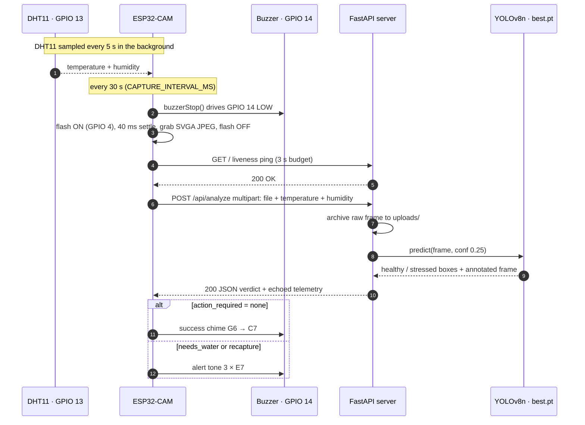

<div align="center">

# 🌱 Nabta (نبتة)

### ESP32-CAM & YOLOv8 Powered Smart Plant Health Monitoring System


</div>

---

## Executive Summary

**Nabta** (Arabic for *sprout*) is an end-to-end edge-IoT plant monitoring
system. It combines **real-time environmental sensing** (temperature and
humidity) with **vision-based AI health analysis** (healthy vs. stressed), and
reports each verdict as a **sound from the device** plus a **log entry on the
server**.

Every 30 seconds an ESP32-CAM photographs the plant under its on-board flash,
bundles the JPEG with the latest DHT11 reading, and POSTs both to a FastAPI
server. A YOLOv8n model trained on two classes, `healthy` and `stressed`,
analyses the frame. The server saves the raw frame and a copy with the
detection boxes drawn on it, then returns a JSON verdict. The board plays a
short chime when the plant is fine and a loud alert when it needs attention.

**Highlights**

- **Vision + telemetry in one payload.** Each frame travels with the
  temperature and humidity at capture time. The server echoes both back, so
  frames and readings stay correlated.
- **Non-blocking firmware.** Three independent `millis()` timers handle sensor
  polling, the capture cycle, and tone playback. Only the HTTP round trip and a
  40 ms flash warm-up block, and both have time limits.
- **Diagnostic logging.** Every raw frame and its YOLO-annotated copy are saved
  to `server/uploads/`, and every verdict is logged with its telemetry.
- **Built for real hardware.** The power path resists brownouts, flash time and
  capture rate are limited to keep the regulators cool, and the buzzer can't get
  stuck on during current spikes.

---

## Table of Contents

1. [Architecture & Workflow](#1-architecture--workflow)
2. [Hardware Bill of Materials](#2-hardware-bill-of-materials)
3. [Wiring & Pin Mapping](#3-wiring--pin-mapping)
4. [System Engineering & Thermal Safeguards](#4-system-engineering--thermal-safeguards)
5. [Repository Structure](#5-repository-structure)
6. [Setup & Installation](#6-setup--installation)
7. [API Reference](#7-api-reference)
8. [Validation & Troubleshooting](#8-validation--troubleshooting)
9. [Known Limitations](#9-known-limitations)
10. [License](#license)

---

## 1. Architecture & Workflow



### Pipeline stages

| # | Stage | Code | What happens |
|---|---|---|---|
| 1 | **Sense** | `firmware/Nabta/sensors.cpp` | The DHT11 is read every 5 s and the last good reading is kept. Until the first valid read, the board sends fallback values (25.0 °C / 50.0 %RH), so a dead sensor never blocks the vision check. |
| 2 | **Capture** | `firmware/Nabta/cam_manager.cpp` | The buzzer is silenced. The flash LED on GPIO 4 turns on for 40 ms, the latest SVGA (800×600) JPEG is taken from the PSRAM frame buffers, and the flash turns off on every code path. |
| 3 | **Transmit** | `firmware/Nabta/net_manager.cpp` | A quick `GET /` ping (3 s limit) checks that the server is reachable. Then the frame and telemetry go out in one `multipart/form-data` POST, assembled in PSRAM (15 s limit). |
| 4 | **Infer** | `server/main.py`, `server/model_inference.py` | The server saves the raw frame and YOLOv8n detects `healthy` / `stressed` regions. The per-box detections are combined into one verdict, and an annotated copy of the frame is saved. |
| 5 | **Respond** | `server/main.py` | The server returns the verdict as JSON, with temperature and humidity echoed back. |
| 6 | **Signal** | `firmware/Nabta/buzzer.cpp` | The frame buffer is released. If `action_required` is `"none"` the board plays the success chime; any other value plays the alert tone. |

### Verdict rules

The server keeps only detections with confidence ≥ **0.25** (`MIN_DETECTION_CONF`) and turns them into one verdict:

| Detections | `plant_health` | `action_required` | Buzzer |
|---|---|---|---|
| None, or the image cannot be decoded | `unknown` (`status: "error"`) | `recapture` | Alert tone |
| More `stressed` boxes than `healthy` boxes, **or** any `stressed` box ≥ **0.60** (`STRESS_ALERT_CONF`) | `stressed` | `needs_water` | Alert tone |
| Anything else | `healthy` | `none` | Success chime |

`confidence` is the highest box confidence of the winning class.

### Acoustic cues

| Cue | Trigger | Frequencies | Pattern |
|---|---|---|---|
| **Boot chime** | Camera initialised at power-up | 880 → 1175 → 1568 Hz (A5 → D6 → G6) | 120 / 120 / 240 ms |
| **Success chime** | `action_required == "none"` | 1568 → 2093 Hz (G6 → C7) | 90 ms per note |
| **Alert tone** | Any other verdict, **or** camera init failure at boot | 2637 Hz (E7) | 3 × (180 ms on, 120 ms off) |
| **Silence** | Upload failed (server unreachable, timeout, non-200 reply) | none | Retried next cycle; the reason goes to the serial log |

---

## 2. Hardware Bill of Materials

| # | Component | Specification | Role |
|---|---|---|---|
| 1 | **ESP32-CAM** | AI-Thinker module, ESP32 dual-core @ 240 MHz, OV2640 2 MP camera, 4 MB PSRAM | Edge node: sensing, capture, Wi-Fi, audio |
| 2 | **DHT11** | 0–50 °C (±2 °C), 20–90 %RH (±5 %RH); 3-pin breakout with on-board pull-up | Environmental telemetry on GPIO 13 |
| 3 | **Passive buzzer** | 3-pin module with driver transistor; no internal oscillator, so it needs a square wave | Acoustic cues on GPIO 14, driven through the ESP32 **LEDC** PWM peripheral via `tone()` |
| 4 | **MB-102 breadboard power supply** | AMS1117 linear regulators, 6.5–12 V DC barrel input, **both rail jumpers set to 5 V** | Regulated 5 V rails for the ESP32-CAM and peripherals |
| 5 | **12 V 1 A DC power adapter** | 5.5 × 2.1 mm barrel plug | Low-impedance input with headroom for current peaks; stops Brownout Detector resets |
| 6 | **On-board white flash LED** | Built into the ESP32-CAM, switched by GPIO 4 | Consistent illumination for every capture |
| 7 | ESP32-CAM-MB programmer | Micro-USB (CH340) shield | Flashing and serial monitor only |
| 8 | Breadboard + jumper wires | Full-size breadboard for the MB-102; male–female and female–female jumpers | Wiring and the shared ground rail |

### Firmware operating parameters

| Parameter | Value |
|---|---|
| Camera output | SVGA 800×600 JPEG, quality 12 (≈ 50 kB/frame) |
| Frame buffers | 2 in PSRAM with `CAMERA_GRAB_LATEST` (falls back to 1 in DRAM if no PSRAM is found) |
| Camera clock (XCLK) | 20 MHz |
| Sensor orientation | Vertical flip + horizontal mirror (the OV2640 is mounted upside down on this board) |
| Wi-Fi | Station mode, modem sleep disabled, non-blocking reconnect every 5 s |
| Serial console | 115200 baud |

---

## 3. Wiring & Pin Mapping

| ESP32-CAM pin | Connects to | Type | Notes |
|---|---|---|---|
| **GPIO 14** | Passive buzzer **signal** (`S` / `I/O`, or `+` on a 2-pin buzzer) | PWM out | Driven by `tone()`; held LOW (push-pull) when idle. Not a boot-strapping pin. |
| **GPIO 13** | DHT11 **DATA** | Digital I/O | The breakout already has the 10 kΩ pull-up; with a bare 4-pin DHT11, add one to 3V3. |
| **GPIO 4** | On-board white **flash LED** | PCB trace | Nothing to wire. The firmware keeps it LOW except during a capture. |
| **5V** | MB-102 **+5 V** rail | Power in | Keep this lead short and thick. |
| **GND** | MB-102 **GND** rail | Ground | Shared reference for every module. |
| — | DHT11 **VCC** / **GND** → MB-102 **+5 V** / **GND** | Power | |
| — | Buzzer **VCC** / **GND** → MB-102 **+5 V** / **GND** | Power | On a 2-pin buzzer, `−` goes to GND and there is no VCC. |
| — | 12 V adapter → MB-102 **DC jack** | Input | Both MB-102 output jumpers on **5 V**. |

> [!IMPORTANT]
> **Every module must share one ground.** The MB-102, ESP32-CAM, DHT11 and
> buzzer grounds must all meet on the same rail, and so does the ESP32-CAM-MB
> programmer's ground when it is attached. A DHT11 on a separate ground returns
> `NaN`. A buzzer on a separate ground either stays silent or injects noise into
> the camera's SCCB lines.

```
        12 V 1 A adapter
               │ DC jack
      ┌────────┴─────────┐
      │      MB-102      │   both rail jumpers → 5 V
      └───┬──────────┬───┘
         +5V        GND ─────────────┬───────────────┬──────────────┐
          │                          │               │              │
          ├────► ESP32-CAM 5V   ESP32-CAM GND    DHT11 GND     Buzzer GND
          ├────► DHT11 VCC
          └────► Buzzer VCC

      ESP32-CAM GPIO 13 ◄──── DHT11 DATA
      ESP32-CAM GPIO 14 ────► Buzzer S
      ESP32-CAM GPIO 4  ───── white flash LED (on-board)
```

**Why GPIO 13 and GPIO 14?** The OV2640 uses most of the ESP32-CAM's I/O. Of
the header pins left over, GPIO 2, 12 and 15 are boot-strapping pins, GPIO 4
drives the flash LED, and GPIO 0/1/3 carry XCLK and the UART. GPIO 13 and
GPIO 14 are the only two with no boot role and no on-board load. The buzzer was
first on GPIO 2 and hissed during Wi-Fi TX. The full reasoning is in
[docs/WIRING.md §3](docs/WIRING.md#3-why-gpio-14-for-the-buzzer).

---

## 4. System Engineering & Thermal Safeguards

### 4.1 Power path: 9 V battery → 12 V 1 A DC adapter

During each cycle the load jumps in steps. The OV2640 draws 180–300 mA while
capturing, the Wi-Fi radio adds bursts of about 250 mA while transmitting, and
the flash LED is on at the same time. The prototype first ran from a
**9 V PP3 battery**. Its internal resistance is high and rises as it drains, so
each TX burst pulled the supply below the ESP32's brownout threshold. The board
then reset partway through an upload:

```
Brownout detector was triggered
```

The fix was a **dedicated 12 V 1 A wall adapter** feeding the **MB-102**, which
regulates it down to the 5 V rails. This low-impedance source has plenty of
current headroom, so TX bursts no longer pull the rail down.

> [!NOTE]
> The MB-102 uses a **linear** AMS1117 regulator, which turns the whole
> input-to-output voltage drop into heat: **P ≈ (V<sub>in</sub> − 5 V) ×
> I<sub>load</sub>**. With 12 V in, a 200 mA average draw means about **1.4 W**
> of heat in a small SOT-223 package. That heat is why the safeguards below
> limit how often and how long the heavy loads run. If the regulator still runs
> hot, a regulated 7.5–9 V adapter keeps the same brownout headroom and cuts
> that heat by about 40–65 %.

### 4.2 Flash timing: `FLASH_SETTLE_MS = 40`

GPIO 4 switches the ESP32-CAM's high-power white LED. If it stays on, it heats
the LED driver and the board's on-board regulator, and it adds a large current
step exactly while the camera draws its peak. `captureFrame()` keeps it brief:

```cpp
digitalWrite(FLASH_GPIO_NUM, HIGH);
delay(FLASH_SETTLE_MS);                // 40 ms: enough for GRAB_LATEST to return a flash-lit frame
camera_fb_t *fb = esp_camera_fb_get();
digitalWrite(FLASH_GPIO_NUM, LOW);     // off on every path, including a failed grab
```

- The flash is on for about 40 ms every 30 s, a duty cycle of about **0.13 %**.
- `cameraInit()` drives GPIO 4 LOW before anything else, so the LED never glows
  from a floating pin at boot.

### 4.3 Capture interval: `CAPTURE_INTERVAL_MS = 30000`

Each cycle packs the heaviest loads (flash, JPEG capture, a ~50 kB Wi-Fi upload)
into a few seconds. A 30 s gap between cycles gives both regulators time to cool
before the next transmission. The first capture runs about 5 s after boot, which
gives the DHT11 time to produce a reading first. If you shorten the interval,
check regulator temperature inside your enclosure first.

### 4.4 Buzzer guard: `buzzerStop()`

Once `tone()` starts the LEDC PWM, the hardware keeps generating it with no CPU
involvement. The note only ends when `buzzerUpdate()` runs in `loop()`. During
capture and upload `loop()` is blocked for up to several seconds. A tone that
was playing when the cycle started would keep sounding through the flash and
Wi-Fi spike, and if the firmware hung there the buzzer would squeal
indefinitely.

`captureAndUpload()` therefore calls `buzzerStop()` **before** the flash turns
on:

```cpp
void buzzerStop() {
  sequence = nullptr;              // buzzerUpdate() can no longer resume the pattern
  pinMode(PIN_BUZZER, OUTPUT);     // push-pull, low impedance
  digitalWrite(PIN_BUZZER, LOW);
  noTone(PIN_BUZZER);
}
```

With GPIO 14 actively driven LOW, the line is not floating, so RF from Wi-Fi TX
bursts can't partly switch on the module's driver transistor and turn into
audible noise. A failed capture needs no extra handling: nothing restarts the
buzzer on that early return.

### 4.5 Other defensive behaviours

| Safeguard | Where | Why |
|---|---|---|
| Frame buffer returned right after the POST, whatever the result | `Nabta.ino` | The camera driver always has a free buffer; a server error can't leak one |
| Liveness `GET /` before the upload | `net_manager.cpp` | An unreachable server is detected within 3 s and reported separately, instead of hanging a 50 kB POST |
| Upload body assembled in PSRAM | `net_manager.cpp` | Keeps ~50 kB off the ~300 kB internal heap |
| Wi-Fi modem sleep disabled | `net_manager.cpp` | Sleep mode added latency and dropped uploads mid-POST |
| Non-blocking reconnect every 5 s | `net_manager.cpp` | A dropped link recovers without stalling sensors or tones |
| DHT11 fallback values | `config.h`, `Nabta.ino` | A missing or failed sensor never blocks the plant-health check |
| Alert tone on camera init failure | `Nabta.ino` | You hear the fault even with no serial monitor attached |
| RSSI and gateway logged on connect | `net_manager.cpp` | Weak signal (below about −75 dBm on the PCB antenna) or a wrong subnet causes most upload failures |

### 4.6 Tuning reference (`firmware/Nabta/config.h`)

| Constant | Default | Purpose |
|---|---|---|
| `PIN_DHT_DATA` | `13` | DHT11 data line |
| `PIN_BUZZER` | `14` | Buzzer signal line |
| `DHT_SENSOR_TYPE` | `DHT11` | Set to `DHT22` for Wokwi simulation |
| `DHT_POLL_INTERVAL` | `5000` ms | Time between temperature/humidity samples |
| `CAPTURE_INTERVAL_MS` | `30000` ms | Time between capture + upload cycles |
| `FLASH_SETTLE_MS` | `40` ms | How long the flash stays on before the frame is grabbed |
| `WIFI_RETRY_INTERVAL` | `5000` ms | Time between reconnect attempts |
| `HTTP_TIMEOUT_MS` | `15000` ms | Time limit for the upload + inference round trip |
| `HTTP_PING_TIMEOUT_MS` | `3000` ms | Time limit for the liveness ping |
| `CAMERA_FRAME_SIZE` | `FRAMESIZE_SVGA` | 800×600 |
| `CAMERA_JPEG_QUALITY` | `12` | 10 (best) … 63 (worst) |
| `DHT_FALLBACK_TEMPERATURE` / `_HUMIDITY` | `25.0` °C / `50.0` %RH | Values sent before the first valid reading |
| `ACTION_NONE` | `"none"` | The `action_required` value that plays the success chime |

---

## 5. Repository Structure

```
Nabta/
├── firmware/
│   └── Nabta/                    # Arduino sketch folder (name must match Nabta.ino)
│       ├── Nabta.ino             # Non-blocking loop: timers, capture cycle, verdict → buzzer
│       ├── config.h              # Pins, intervals, camera and tone tables (tune here)
│       ├── camera_pins.h         # AI-Thinker OV2640 pin map + flash LED (fixed by the PCB)
│       ├── cam_manager.h / .cpp  # Camera init, flash-assisted capture, frame buffer release
│       ├── net_manager.h / .cpp  # Wi-Fi reconnect, liveness ping, multipart upload, JSON parse
│       ├── sensors.h / .cpp      # millis()-throttled DHT11 sampling
│       ├── buzzer.h / .cpp       # Non-blocking tone player + buzzerStop() guard
│       ├── secrets.h.example     # Template for Wi-Fi credentials and server URL
│       └── secrets.h             # Your local copy (git-ignored, never committed)
├── server/
│   ├── main.py                   # FastAPI app: GET / and POST /api/analyze
│   ├── model_inference.py        # YOLOv8 inference + verdict rules (self-check in __main__)
│   ├── mock_inference.py         # Model-free colour heuristic, same JSON contract
│   ├── best.pt                   # Trained YOLOv8n weights (classes: healthy, stressed)
│   ├── requirements.txt          # Python dependencies
│   └── uploads/                  # Raw + annotated frames (contents git-ignored)
├── docs/
│   └── WIRING.md                 # In-depth wiring guide and pin rationale
├── Computer_vision_model.ipynb   # Colab notebook that trained best.pt
├── best.pt                       # Copy of the trained weights next to the notebook
├── diagram.json                  # Wokwi simulation circuit
├── wokwi.toml                    # Wokwi firmware paths
├── .gitignore                    # Ignores secrets.h, build output, uploads/, virtualenvs
├── LICENSE                       # MIT
└── README.md
```

---

## 6. Setup & Installation

### 6.1 Firmware

#### Prerequisites

- **Arduino IDE 2.x** with **esp32 core 3.x** by Espressif. Boards Manager URL:
  `https://espressif.github.io/arduino-esp32/package_esp32_index.json`
- Libraries (Library Manager):
  - **DHT sensor library** by Adafruit (it also installs **Adafruit Unified Sensor**)
  - **ArduinoJson** v7 by Benoit Blanchon
- `esp_camera.h` comes with the core, so the OV2640 needs nothing extra.

#### Step 1: Credentials

Copy the template. `secrets.h` is git-ignored, so your credentials never leave
your machine.

```bash
cp firmware/Nabta/secrets.h.example firmware/Nabta/secrets.h
# Windows PowerShell:
# Copy-Item firmware\Nabta\secrets.h.example firmware\Nabta\secrets.h
```

Then edit `firmware/Nabta/secrets.h`:

```cpp
#define WIFI_SSID          "HomeWiFi"          // 2.4 GHz network (the ESP32 has no 5 GHz radio)
#define WIFI_PASSWORD      "your-password"
#define SERVER_UPLOAD_URL  "http://192.168.1.50:8000/api/analyze"
```

`SERVER_UPLOAD_URL` must be the **LAN IPv4 address** of the machine running the
backend (`ipconfig` on Windows, `ip addr` on Linux, `ipconfig getifaddr en0` on
macOS). Do not use `localhost`: the ESP32 would resolve that to itself.

#### Step 2: Board settings

| Setting | Value |
|---|---|
| Board | AI Thinker ESP32-CAM (`esp32:esp32:esp32cam`) |
| PSRAM | Enabled |
| Partition Scheme | Huge APP (3MB No OTA/1MB SPIFFS) |
| CPU Frequency | 240 MHz |
| Upload Speed | 115200 |

#### Step 3: Compile & flash

**Option A: Arduino IDE.** Open `firmware/Nabta/Nabta.ino`, apply the board
settings above, seat the module on the ESP32-CAM-MB shield, and click
**Upload**.

**Option B: arduino-cli**

```bash
arduino-cli config add board_manager.additional_urls https://espressif.github.io/arduino-esp32/package_esp32_index.json
arduino-cli core update-index
arduino-cli core install esp32:esp32
arduino-cli lib install "DHT sensor library" "Adafruit Unified Sensor" ArduinoJson

arduino-cli compile --fqbn esp32:esp32:esp32cam firmware/Nabta
arduino-cli upload  --fqbn esp32:esp32:esp32cam -p COM5 firmware/Nabta   # your port, e.g. /dev/ttyUSB0 on Linux
```

**Option C: PlatformIO.** The repo has no `platformio.ini`. Create one at the
repo root that points at the sketch folder. It uses the
[pioarduino](https://github.com/pioarduino/platform-espressif32) platform,
because the firmware targets Arduino-ESP32 core 3.x:

```ini
[platformio]
src_dir = firmware/Nabta

[env:esp32cam]
platform = https://github.com/pioarduino/platform-espressif32/releases/download/stable/platform-espressif32.zip
board = esp32cam
framework = arduino
monitor_speed = 115200
board_build.partitions = huge_app.csv
lib_deps =
    adafruit/DHT sensor library
    adafruit/Adafruit Unified Sensor
    bblanchon/ArduinoJson@^7
```

```bash
pio run -e esp32cam -t upload && pio device monitor
```

> [!WARNING]
> **Do not rename `net_manager.*` to `network.*`.** Core 3.x ships its own
> `<Network.h>`, which `WiFi.h` and `HTTPClient.h` include. On case-insensitive
> filesystems (Windows, macOS), a local `network.h` hides it. The build then
> fails with broken WiFi/HTTPClient declarations and a misleading
> `redefinition of struct InferenceResult`.

#### Step 4: First boot

Open the serial monitor at **115200 baud**. A rising three-note chime means the
camera initialised. Expected log:

```
[camera] ready (PSRAM: yes)
[wifi] connecting to HomeWiFi
[env] 24.3 C / 41.0 %RH
[wifi] connected, ip=192.168.1.37 gateway=192.168.1.1 rssi=-58 dBm
[net] POST 51580 bytes (image 51204)
[net] HTTP response code: 200
[net] HTTP response body: {"status":"success","plant_health":"healthy","confidence":0.91,"action_required":"none","temperature":24.3,"humidity":41.0}
[loop] health=healthy confidence=0.91 action=none
```

### 6.2 Backend

#### Step 1: Environment (Python 3.10+)

```bash
cd server
python -m venv venv
source venv/bin/activate            # Windows PowerShell: .\venv\Scripts\Activate.ps1
pip install -r requirements.txt     # fastapi, uvicorn, python-multipart, pillow, ultralytics, torch
```

> [!TIP]
> On a host without a CUDA GPU, install the CPU-only PyTorch wheel first. It is
> far smaller than the default:
> `pip install torch --index-url https://download.pytorch.org/whl/cpu`

#### Step 2: Model weights

The trained weights are already at `server/best.pt`, and
`model_inference.py` loads them from there at startup. To use retrained
weights, replace that file. The verdict rules match the class names exactly,
so the new model must keep the classes **`healthy`** and **`stressed`**.

Check the model and verdict logic without a board:

```bash
python model_inference.py
# model_inference self-check passed
```

#### Step 3: Run the server

```bash
uvicorn main:app --host 0.0.0.0 --port 8000
```

- **`--host 0.0.0.0` is required.** If the server binds to `127.0.0.1`, the
  ESP32 can't reach it.
- Allow inbound TCP 8000 through the host firewall:
  - Windows (admin PowerShell): `New-NetFirewallRule -DisplayName "Nabta API" -Direction Inbound -Protocol TCP -LocalPort 8000 -Action Allow`
  - Linux (ufw): `sudo ufw allow 8000/tcp`
- From a phone or another PC on the same network, open
  `http://192.168.1.50:8000/` (with your server's IP). A reply of
  `{"status":"ok",...}` means the ESP32 can reach it too.
  Interactive Swagger docs are at `/docs`.

Every analysed frame produces one server log line:

```
[20260929_142210_518233] 51204 bytes | 24.3 C | 41.0 %RH -> healthy (0.91) / none
```

#### Server tuning (`server/model_inference.py`)

| Constant | Default | Effect |
|---|---|---|
| `MIN_DETECTION_CONF` | `0.25` | Boxes below this confidence are ignored |
| `STRESS_ALERT_CONF` | `0.60` | One `stressed` box at or above this triggers `needs_water`, even if healthy boxes outnumber it |

#### Running without the model

`mock_inference.py` returns the same JSON contract using a green-vs-red colour
heuristic, with no PyTorch needed. To use it, change the import in `main.py` to
`from mock_inference import analyze`. It does not write annotated frames.

### 6.3 Simulation with Wokwi (optional)

`wokwi.toml` and `diagram.json` connect a simulated ESP32-CAM to a DHT sensor on
GPIO 13 and a buzzer on GPIO 14. Export the binaries, then start the simulator
(Wokwi for VS Code → **Wokwi: Start Simulator**):

```bash
arduino-cli compile --fqbn esp32:esp32:esp32cam --export-binaries firmware/Nabta
```

- The camera isn't simulated, so boot plays the **alert tone** instead of the
  chime. That still tests the buzzer path on GPIO 14.
- Wokwi has no DHT11 part, so the diagram uses `wokwi-dht22` (same pinout). Set
  `DHT_SENSOR_TYPE` to `DHT22` in `config.h` while simulating; otherwise the
  readings come out at the wrong scale.
- The simulated Wi-Fi network is `Wokwi-GUEST` with an empty password.

### 6.4 Retraining the model

`Computer_vision_model.ipynb` is a Google Colab notebook that trains the
detector:

| Setting | Value |
|---|---|
| Base model | `yolov8n.pt` (Ultralytics YOLOv8 nano) |
| Dataset | Roboflow plant-health dataset, classes `healthy` / `stressed` |
| Epochs / early-stop patience | 50 / 15 |
| Image size / batch | 640 / 16 |

Run it in Colab with your own Roboflow API key, download
`runs/detect/plant_health_model/weights/best.pt`, and copy it to
`server/best.pt`.

---

## 7. API Reference

**Base URL:** the server's LAN address on port 8000, e.g. `http://192.168.1.50:8000`.
FastAPI also serves interactive documentation at `/docs` (Swagger UI) and `/redoc`.

### `GET /`: Liveness probe

The firmware calls this before every upload to confirm the server is reachable.

**Response `200 OK`**

```json
{
  "status": "ok",
  "uploads": 42
}
```

| Field | Type | Description |
|---|---|---|
| `status` | string | Always `"ok"` while the server is running |
| `uploads` | integer | Number of raw frames archived in `server/uploads/` (annotated copies excluded) |

### `POST /api/analyze`: Analyse one frame

**Request:** `multipart/form-data`

| Field | Type | Required | Description |
|---|---|---|---|
| `file` | binary (`image/jpeg`) | yes | The captured frame |
| `temperature` | float | yes | Air temperature in °C |
| `humidity` | float | yes | Relative humidity in % |

Example with `curl`:

```bash
curl -X POST http://localhost:8000/api/analyze \
  -F "file=@leaf.jpg;type=image/jpeg" \
  -F "temperature=24.3" \
  -F "humidity=41.0"
```

The raw request the ESP32 sends:

```http
POST /api/analyze HTTP/1.1
Content-Type: multipart/form-data; boundary=----NabtaFormBoundary7MA4YWxkTrZu0gW

------NabtaFormBoundary7MA4YWxkTrZu0gW
Content-Disposition: form-data; name="temperature"

24.3
------NabtaFormBoundary7MA4YWxkTrZu0gW
Content-Disposition: form-data; name="humidity"

41.0
------NabtaFormBoundary7MA4YWxkTrZu0gW
Content-Disposition: form-data; name="file"; filename="frame.jpg"
Content-Type: image/jpeg

(binary JPEG data, ~50 kB at SVGA)
------NabtaFormBoundary7MA4YWxkTrZu0gW--
```

**Response `200 OK`: healthy plant**

```json
{
  "status": "success",
  "plant_health": "healthy",
  "confidence": 0.91,
  "action_required": "none",
  "temperature": 24.3,
  "humidity": 41.0
}
```

**Response `200 OK`: stressed plant**

```json
{
  "status": "success",
  "plant_health": "stressed",
  "confidence": 0.72,
  "action_required": "needs_water",
  "temperature": 24.3,
  "humidity": 41.0
}
```

**Response `200 OK`: no plant detected, or the image cannot be decoded**

```json
{
  "status": "error",
  "plant_health": "unknown",
  "confidence": 0.0,
  "action_required": "recapture",
  "temperature": 24.3,
  "humidity": 41.0
}
```

| Field | Type | Values |
|---|---|---|
| `status` | string | `"success"` or `"error"` |
| `plant_health` | string | `"healthy"`, `"stressed"`, `"unknown"` |
| `confidence` | float | `0.0`–`1.0`, highest box confidence of the winning class |
| `action_required` | string | `"none"`, `"needs_water"`, `"recapture"` |
| `temperature` | float | Echo of the request field |
| `humidity` | float | Echo of the request field |

**Side effects:** the raw frame is saved as `uploads/<timestamp>.jpg`, and the
frame with boxes drawn on it as `uploads/annotated_<timestamp>.jpg`.

**Response `422 Unprocessable Entity`:** a field is missing or not numeric.

```json
{
  "detail": [
    { "type": "missing", "loc": ["body", "humidity"], "msg": "Field required", "input": null }
  ]
}
```

#### How the firmware handles each outcome

| Outcome | Firmware reaction |
|---|---|
| `200` + `action_required: "none"` | Success chime |
| `200` + any other `action_required` | Alert tone |
| `200` without `plant_health`, or invalid JSON | Logged as a parse failure, silent |
| Non-`200` status, timeout, or server unreachable | Logged with HTTP/transport code, silent, retried next cycle |

---

## 8. Validation & Troubleshooting

### End-to-end checklist

1. **Server reachable.** `http://<server-ip>:8000/` returns `{"status":"ok",...}` from another device on the LAN.
2. **Boot chime.** Power the board: three rising notes mean the camera is up.
3. **Telemetry.** Breathe on the DHT11. Humidity should rise within two poll cycles (10 s).
4. **Frames landing.** `server/uploads/` gains a raw and an annotated JPEG every 30 s.
5. **Verdicts.** Point the camera at a healthy plant, then a wilted one. The cue should switch from chime to alert. With no plant in frame the verdict is `recapture`, which also plays the alert.

### Common issues

| Symptom | Likely cause | Fix |
|---|---|---|
| `Brownout detector was triggered`, reset loop | Supply voltage sagging under load | Power through the MB-102 + DC adapter, not a battery or USB alone. Keep the 5 V lead short; add 470–1000 µF across the 5 V/GND rail near the board. |
| Alert tone immediately at boot | `esp_camera_init` failed | Check the 5 V supply first, then that PSRAM is enabled and the camera ribbon is seated. |
| `[net] ping ... failed, HTTP -1` | Server unreachable | Run uvicorn with `--host 0.0.0.0`, open port 8000 in the firewall, check the IP in `secrets.h` and that both devices are on the same subnet. |
| `[sensors] DHT11 read failed` repeatedly | Wiring or ground | DATA on GPIO 13, shared ground, pull-up present. |
| Black or striped frames in `uploads/` | Power instability during capture | Same as brownout: stiffer 5 V rail, bulk capacitor. |
| Constant hiss or whine from the buzzer | Floating signal line or wrong pin | Signal on GPIO 14; keep the `buzzerInit()` / `buzzerStop()` LOW drive. |
| Every cycle returns `recapture` | Plant out of frame, too dark, or out of focus | Check the `annotated_*.jpg` frames and reposition the camera. |
| MB-102 regulator too hot to touch | 12 V linear drop (§4.1) | Use a 7.5–9 V adapter or raise `CAPTURE_INTERVAL_MS`. |
| Build errors in WiFi/HTTPClient, `redefinition of struct InferenceResult` | A local `network.h` hides the core's `Network.h` | Keep the `net_manager.*` file names (§6.1). |

---

## 9. Known Limitations

- **LAN-only.** No TLS and no authentication on the upload endpoint.
- **Vision-only verdict.** Temperature and humidity are logged and echoed back
  but don't affect the model's decision.
- **Blocking upload.** `uploadFrame()` blocks `loop()` for the HTTP round trip
  (bounded by `HTTP_TIMEOUT_MS`). Everything else is timer-driven.
- **Unbounded storage.** Each cycle writes two JPEGs to `server/uploads/`
  (about 2,880 cycles/day at the default interval), and nothing deletes old
  files.
- **Shared alert.** `needs_water` and `recapture` play the same alert tone. The
  serial log and server log tell them apart.
- **Sensor accuracy.** The DHT11 is accurate to ±2 °C and ±5 %RH, so treat its
  readings as indicative.
- **Unpinned dependencies.** `requirements.txt` doesn't pin versions. Pin them
  if you need reproducible deployments.

---

## License

Released under the [MIT License](LICENSE). © 2026 Meshari.
